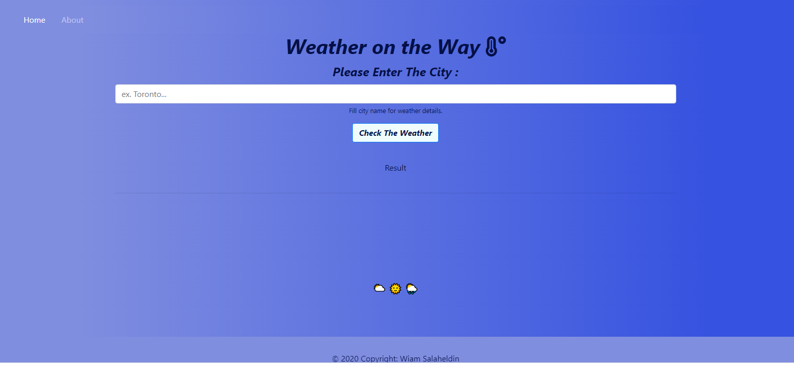

**Weather on the Way**

Get more information about the real situation outside your window using Weather on the way app.

**About the app**

Weather on the way is a single app application (front-end website) where you can check the forecast of any city you would like.

**Project requierments**

Brief In this project, you’ll be building a frontend-only website using the technologies that you have learned throughout Interactive Frontend Development. You can either choose to use one of the example briefs below, or you can use your idea for the website.
Create a Single Page Application that relies heavily on one or more APIs

**Languages**

* HTML

* CSS

* BootStrap

* JQuery

* ajax

**Skills**

* API

__screen blueprint__

[__Give it try__](https://wiamsalaheldin.github.io/weather-app/index.html)

